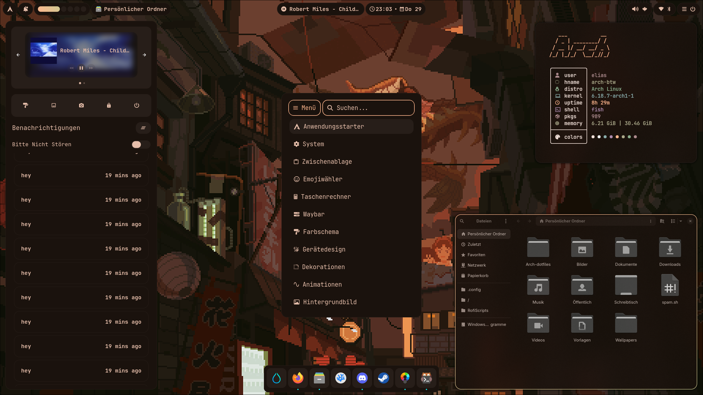
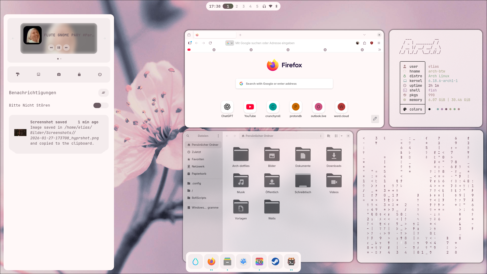
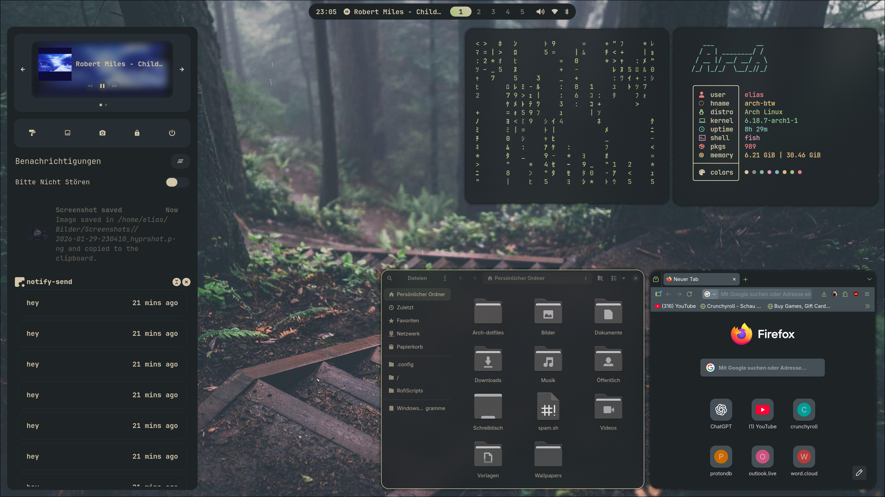

# Arch-Dotfiles





## Disclaimer

Some knowledge of Arch is a prerequisite.  
These dotfiles are also specifically designed to suit my workflow and may not be the easiest to work with.

## How to Install

- Clone this repo into your home directory
- cd into ```~/Arch-Dotfiles```
- perform ```stow .``` and resolve any possible conflicts that may arise (in most cases because you have config files in ~/.config/ which stow will try to overwrite but can't)
- install my packages from ```~/Arch-Dotfiles/pkglist.txt``` using ```~/Arch-Dotfiles/InstallationScripts/yay.sh```
- read and execute anything else in ```~/Arch-Dotfiles/InstallationScripts``` to your liking, they are very specific! (I recommemd at least running symlinks.sh to symlink everthing to it's proper place)
- Reboot
> optionally clone my Wallpapers repository to your home directory, as my scripts will look for wallpapers within ```~/Wallpapers/Walls-dark/Walls``` or ```~/Wallpapers/Walls-light/Walls```

## Important Keybinds

- Terminal (Kitty): `SUPER + Q`
- Browser (Firefox): `SUPER + F`
- General-purpose launcher: `SUPER + Space`  
  (You can go to System → "Kurzbefehle" to change the keybinds to your liking)
- Application Launcher: `SUPER + R`  
  (Or through the general-purpose launcher: Anwendungsstarter)

## How to Change the Language

- Edit the Rofi scripts in `~/NixOS-Dotfiles/RofiScripts` and change everything to your desired language
- Edit `~/NixOS-Dotfiles/NixOS/configuration.nix` and change the locale to your desired setting

## Important packages that I use for my rice

**Fonts:** 
- JetBrainsMono Nerd Font (for waybar and rofi)
- Adwaita Sans (system wide)

**Bar/Menu**
- Rofi as launcher
- Waybar as bar
- quickshell is not ready to use, I am still learning

**Colors**
- Matugen
- Pywalfox (nixpkg is called pywalfox-native)

**GTK Theme**
- adw-gtk3 powered by matugen colors

**Icons/Cursor** 
- Papirus-Black --> icon theme
- Bibata-Modern-Ice --> cursor

**Notification center**
- swaync
- libnotify (necessary on NixOS)

